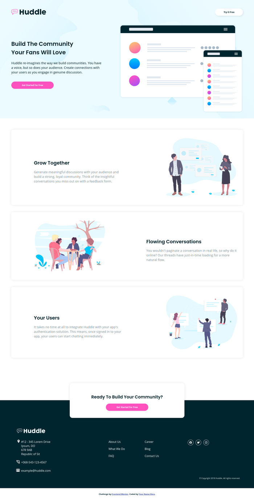

# Frontend Mentor - Huddle landing page with alternating feature blocks solution

This is a solution to the [Huddle landing page with alternating feature blocks challenge on Frontend Mentor](https://www.frontendmentor.io/challenges/huddle-landing-page-with-alternating-feature-blocks-5ca5f5981e82137ec91a5100). Frontend Mentor challenges help you improve your coding skills by building realistic projects. 

## Table of contents

- [Overview](#overview)
  - [The challenge](#the-challenge)
  - [Screenshot](#screenshot)
  - [Links](#links)
- [My process](#my-process)
  - [Built with](#built-with)
  - [What I learned](#what-i-learned)
  - [Continued development](#continued-development)
  - [Useful resources](#useful-resources)
- [Author](#author)
- [Acknowledgments](#acknowledgments)

## Overview

### The challenge

Users should be able to:

- View the optimal layout for the site depending on their device's screen size
- See hover states for all interactive elements on the page

### Screenshot

### Links

- Solution URL: https://www.frontendmentor.io/solutions/nice-responsive-htmlcss-using-gap-property-and-logo-filter-in-footer-ogWNbBRYM
- Live Site URL: https://loganwoolf.github.io/huddle-alternating/

## My process

### Built with

- Semantic HTML5 markup
- CSS custom properties
- CSS Grid and Flexbox
- [Ionicons](https://ionic.io/ionicons)

### What I learned

- CSS comments are awesome.

- rems are a very nice unit for padding/margins.

- CSS gap is perfect for spacing items, it saves having to add a padding to every item in a container.

- Mobile first workflow. Mobile first workflow. Mobile first workflow.

- Defining colors in variables saves a lot of hassle when they need to change.

### Continued Development

- Should find out how to make absolutely positioned elements responsive when the size of the element changes. Might try viewport units next time.

### Useful resources

- [CSS Filter Generator](https://codepen.io/sosuke/pen/Pjoqqp) - This pen will take a hex color and convert it into a CSS filter. It was used on the footer logo and is incredibly useful.

## Author

- Website - [Logan Woolf](https://loganwoolf.github.io/)
- Frontend Mentor - [@loganwoolf](https://www.frontendmentor.io/profile/loganwoolf)
- Twitter - [@logan__woolf](https://www.twitter.com/logan__woolf)